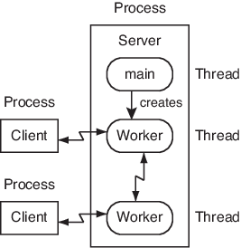

# POPL Project Group 7
Project to fulfil partial requirements of course CSF301 under Professor Dr. Kunal Korgaonkar.

Group Members:  
Arnav Goyal - 2021A7PS2596G - f20212596@goa.bits-pilani.ac.in  
Pranav Bajpai - 2021A7PS2062G - f20212062@goa.bits-pilani.ac.in    
Aryan Nambiar - 2021A7PS2619G - f20212619@goa.bits-pilani.ac.in  
Amey Patil - 2021A7PS2740G - f20212740@goa.bits-pilani.ac.in  

## Problem Statement

As a part of this project, we have implemented a **Multithreaded File Server** in Rust and used its features to overcome problems generally encountered in C-based client-server architecture, such as Buffer Overflow Attacks, Dangling Pointer Vulnerability, Size of Code and Concurrency advantages.  
  
Rust offers several features such as memory safety, ownership system, borrowing and lifetimes and safe concurrency without data races, making Rust much safer and easier to maintain in the case of client-server architecture.

## Software Architecture 
Our software architecture adopts the client-server model, a widely recognized paradigm that divides the system into two primary components – the **client** and the **server**. This architectural approach is extensively employed in distributed systems, facilitating effective communication and the segregation of responsibilities between the user interface and backend services. Here's a more detailed overview:  
  
  
    
**Components**:  
  
**Client**:  
The client embodies the end-user application or device engaging with the system. This component encompasses the user interface and application logic, bearing the responsibility for rendering and presenting data to the user. Clients initiate requests and interact with the server to fulfill user-oriented functionalities.  
**Server**:  
The server serves as the centralized system or application responsible for delivering services, resources, or data to clients. It plays a pivotal role in managing business logic, data storage, and processing client requests. By concentrating these responsibilities on the server side, the client-server model promotes a clear separation of concerns.    

In our client server model of architecture **Worker threads** constitute a pivotal component of our software architecture, offering several key advantages in the context of a client-server system:  
  
  
1.**Enhanced Concurrency and Parallelism**:  
Worker threads empower our server to concurrently process multiple client requests, allowing for the simultaneous handling of distinct connections or tasks. This concurrent execution optimally utilizes available resources and significantly enhances overall system efficiency.

2.**Scalability Boost**:  
Worker threads play a vital role in scaling our client-server architecture. As the volume of client connections grows, we can seamlessly incorporate additional worker threads to manage the increasing workload. This scalability feature ensures that our server can adeptly handle a larger number of simultaneous connections without compromising performance.

3.**Elevated Responsiveness**:  
Through the judicious use of worker threads, our server can adeptly manage numerous requests concurrently. This concurrent approach minimizes client waiting times, leading to a notable improvement in system responsiveness. This is particularly beneficial in scenarios where clients anticipate low-latency responses, contributing to an overall enhanced user experience.

4.**Task Distribution**:  
Worker threads play a key role in distributing tasks across the available processing resources. In a client-server architecture, each worker thread can be assigned to handle a specific client connection or task, ensuring that tasks are processed in parallel and that the load is evenly distributed.

Our codebase is structured around the principles of RESTful Architecture, a widely adopted design style for developing web services and APIs:

    
**RESTful Architecture**:  
Representational State Transfer (REST) embodies an architectural approach that leverages standard HTTP methods for seamless communication. Within this framework, RESTful services operate in a stateless manner, interacting with resources identified by well-defined URLs. This design philosophy not only aligns with industry best practices but also facilitates the creation of scalable, interoperable, and easily maintainable web services and APIs.

## POPL Aspects
Rust and C are both programming languages, but they have different design philosophies and features. Here are some advantages of Rust over C:

1. **Memory Safety:**
   - One of the key advantages of Rust is its strong emphasis on memory safety without sacrificing performance. Rust has a robust ownership system and a borrow checker that prevents common programming errors like null pointer dereferencing, buffer overflows, and data races.

2. **Ownership System:**
   - Rust introduces a unique ownership system that enforces strict rules on how memory is accessed and modified. This helps prevent issues like dangling pointers and data races. The ownership system enables automatic memory management without garbage collection.

3. **Borrowing and Lifetimes:**
   - Rust uses a system of borrowing and lifetimes to manage references to data. This ensures that references are valid for the appropriate scope and prevents dangling references. The borrow checker analyzes code at compile time to ensure these rules are followed.

4. **Concurrency without Data Races:**
   - Rust provides concurrency support without the risk of data races. The ownership and borrowing system, along with the absence of shared mutable state by default, makes it easier to write concurrent code that is safe and free from race conditions.

5. **Community and Ecosystem:**
   - Rust has a vibrant and growing community with an active ecosystem. The package manager, Cargo, simplifies dependency management and project setup. The community promotes best practices, and there is a focus on documentation and tooling.

6. **Modern Language Features:**
   - Rust includes modern programming language features, such as pattern matching, algebraic data types, and traits (similar to interfaces in other languages). These features contribute to more expressive and readable code.

7. **Tooling and Package Management:**
   - Cargo, Rust's package manager, simplifies dependency management and project build processes. It also encourages standardized project layouts and makes it easy to build, test, and package Rust projects.

8. **No Undefined Behavior by Default:**
   - Rust aims to eliminate undefined behavior by default. This is achieved through the ownership system, bounds checking, and other safety features. In C, undefined behavior can lead to unpredictable results and security vulnerabilities.

9. **Compatibility and Interoperability:**
   - Rust is designed to be compatible with C, allowing for easy integration with existing C code. Rust can call C functions directly, and C code can call Rust functions through a foreign function interface (FFI).
While Rust offers these advantages, it's important to note that the choice between Rust and C depends on the specific requirements of a project. C remains a powerful language with a long history, and in some contexts, it may still be the preferred choice. Rust, however, addresses many modern programming challenges and provides a safer alternative, especially for systems programming.

## Potential for future work
Here are some of the avenues for future work:

1. **Integration with Other Rust Ecosystem Tools:**
    - Explore the integration of other Rust tools and libraries, such as Tokio or Actix, to further enhance the system's capabilities, especially in terms of asynchronous networking and handling concurrent connections.
  
2. **Security Enhancements:**
    - Implement secure communication protocols such as TLS/SSL to encrypt data during transmission between the client and server.
    - Integrate authentication mechanisms to ensure that only authorized users can access and manipulate files on the server.    

3. **Cross-Platform Compatibility:**
    - Ensure that the server application is cross-platform by addressing any platform-specific code. This may involve testing and adapting the codebase for different operating systems.
  
4. **Performance Optimization:**
    - Conduct profiling and performance analysis to identify bottlenecks and areas for improvement. Optimize critical sections of the codebase to enhance overall system performance.

## Comparison with C

This project aims to showcase the advantages of Rust over C in the context of file server interactions. Some key points of comparison include:

Memory Safety: Rust's ownership system helps prevent common memory-related issues, providing a safer environment compared to C.

Concurrency: Rust's ownership and borrowing system facilitates easy and safe implementation of concurrency, enhancing performance without sacrificing safety.

Error Handling: Rust's Result type and exhaustive pattern matching make error handling more explicit and manageable compared to C's error codes.

## Acknowledgments
We would like to express our gratitude to Professor Dr. Kunal Korgaonkar for his guidance and support throughout the development of this project.

